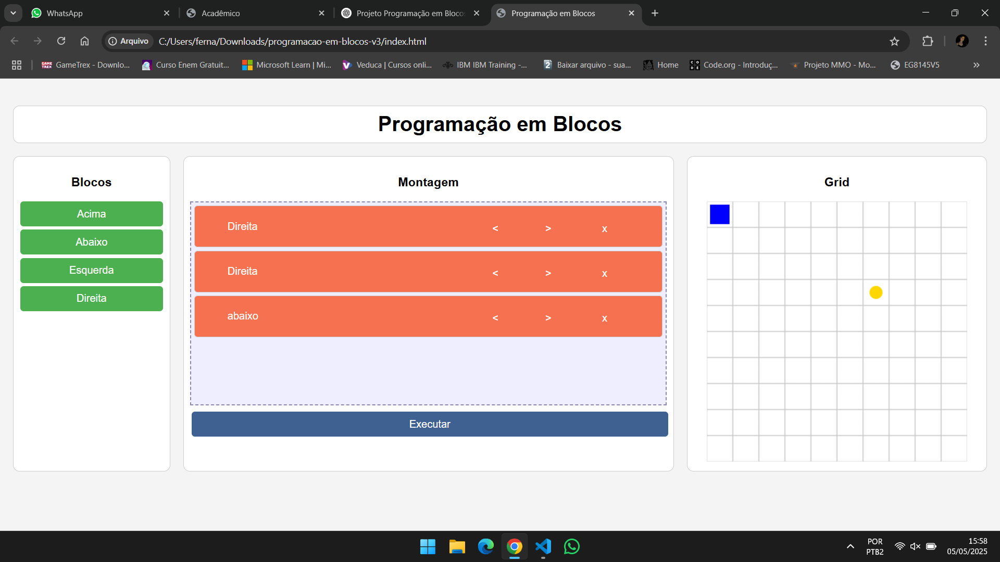

# 🧱 Programação em Blocos

Projeto educativo que simula lógica de programação através de blocos de comandos arrastáveis. O objetivo é guiar o personagem até um ponto específico no grid, utilizando apenas os blocos disponíveis.

## 🧠 Objetivo

- Ensinar lógica de programação de forma visual e intuitiva.
- Desenvolver o raciocínio sequencial e espacial dos usuários.
- Estimular o aprendizado lúdico com desafios e interação.

## ✨ Funcionalidades

- Arrastar e soltar blocos como **Acima**, **Abaixo**, **Esquerda**, **Direita**.
- Montar uma sequência de comandos no painel de montagem.
- Executar os comandos e ver o personagem se mover no grid.
- Objetivo (ponto de chegada) é aleatório a cada recarregamento da página.
- Possibilidade de excluir ou reorganizar blocos facilmente.

## 📸 Preview

 

## 🛠️ Tecnologias Utilizadas

- HTML5
- CSS3
- JavaScript
- Canvas API

## 🚀 Como Executar

1. Clone este repositório:
   ```bash
   git clone https://github.com/SofiaAraki/block-programming.git 
   
2. Navegue até a pasta:

   ```bash
   cd block-programming 
   
3. Abra o arquivo `index.html` em qualquer navegador moderno.

## 📌 Estrutura do Projeto

```
programacao-em-blocos/
│
├── index.html         # Estrutura principal da página
├── style.css          # Estilo da interface
├── script.js          # Lógica do jogo
└── README.md          # Este arquivo
```

## 🔮 Futuras Melhorias

* Adição de blocos de controle como "Repetir" e "Se".
* Sistema de níveis com dificuldade progressiva.
* Salvamento de progresso.
* Personagens animados e efeitos sonoros.

Desenvolvido com ❤️ por [Sofia Araki](https://github.com/SofiaAraki)
